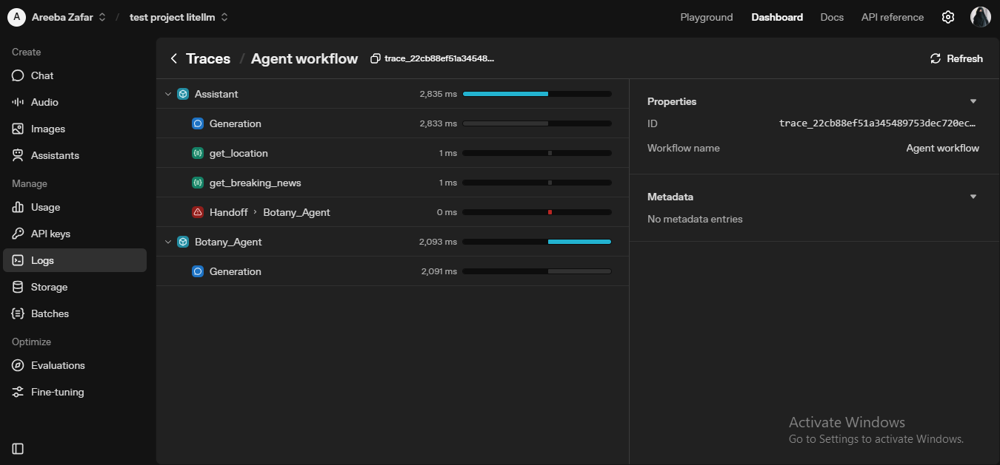
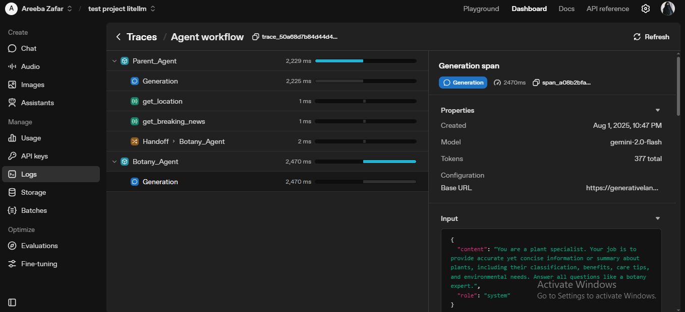

# 🤖 Multi-Agent Tool & Handoff Example (Tracing Enabled)

This project demonstrates how to use **two tools** and **two handoffs** in a single prompt using the **OpenAI Agents SDK** with tracing enabled for debugging and analysis.

## 📌 Key Features
- **Two Tools:**
  - `get_location()` → Returns the assistant's current location.
  - `get_breaking_news()` → Returns latest breaking news.
- **Two Handoffs:**
  - `Botany_Agent` → Handles plant-related queries.
  - `Medicine_Agent` → Handles medicine-related queries.
- **Tracing Enabled:**  
  Run results can be inspected directly from your **OpenAI Dashboard → Tracing**.

## 🗂 File Overview
- **main.py** → Contains:
  - Tool definitions
  - Agent setup (Assistant + Handoffs)
  - Multi-query test prompt
  - Printing structured run results

- **config.py** → Manages:
  - `.env` loading
  - Gemini/OpenAI API configuration
  - RunConfig setup

## ▶️ How to Run

1. Install dependencies:

```bash
uv add openai-agents python-dotenv
```

2. Add your OpenAI API key to .env:

```ini
OPENAI_API_KEY=your_api_key_here
```

3. Run the script:

```bash
python main.py
```

4. View tracing logs in OpenAI Dashboard → Tracing.

## 💡 Example Output
Input prompt:

```pgsql
1. What is my current location?
2. Any breaking news?
3. What is photosynthesis?
4. Tell me about panadol medicine?
```

- **Location & news** → handled via tools.
- **Photosynthesis** → handled by Botany_Agent.
- **Panadol** → handled by Medicine_Agent.

## 📸 Tracing Logs

### Logs With Error



### Logs Without Error




**Created by:** *Areeba Zafar ✨*


